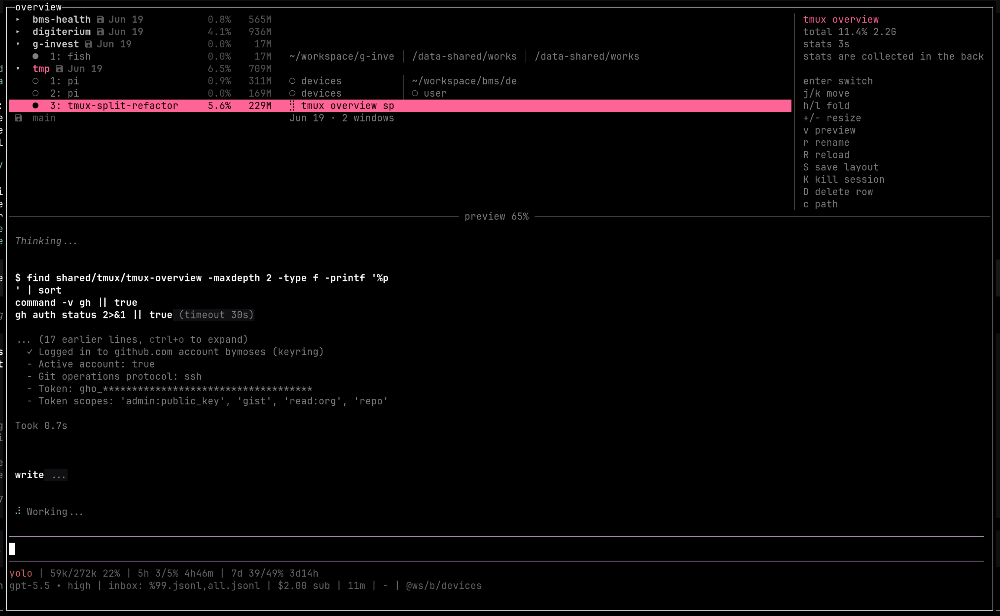

# tmux-overview

A small rustc-only tmux session/window overview popup.



## Features

- Lists tmux sessions and windows with CPU/RSS stats.
- Live pane-title/window labels.
- Preview pane with multi-pane layout rendering.
- Save, restore, rename, delete, and kill session/window flows.
- Persisted session fold state.
- No Cargo project required; builds directly with `rustc`, falling back to Docker.

## Prerequisites

Runtime:

- `tmux`
- `ps`, `stty`, `date`, and a POSIX-ish shell environment

Build, choose one:

- `rustc`
- or `docker` for the wrapper's fallback build path, using `rust:1-alpine` by default

Tests:

- `bun`
- `tmux`
- `rustc` or `docker`

## Install

Clone somewhere under your tmux config, for example:

```sh
git clone https://github.com/bymoses/tmux-overview ~/.config/tmux/tmux-overview
```

Add a binding to `~/.config/tmux/tmux.conf`:

```tmux
bind-key s display-popup -E -w 90% -h 90% -T "overview" "~/.config/tmux/tmux-overview/tmux-overview.sh"
```

Reload tmux config, then press prefix + `s`.

## Build/run

The wrapper builds into `${XDG_CACHE_HOME:-$HOME/.cache}/tmux-overview/tmux-overview` when sources change:

```sh
./tmux-overview.sh
```

Manual compile without Cargo:

```sh
rustc -C opt-level=z -C strip=symbols src/main.rs -o tmux-overview
```

Docker compile:

```sh
docker run --rm \
  -v "$PWD:/src:ro" \
  -v "$PWD/.build:/out" \
  -w /src \
  rust:1-alpine \
  rustc -C opt-level=z -C strip=symbols /src/src/main.rs -o /out/tmux-overview
```

## Tests

End-to-end tests are Bun-based and drive isolated tmux servers:

```sh
bun test tests/e2e.test.ts
```
